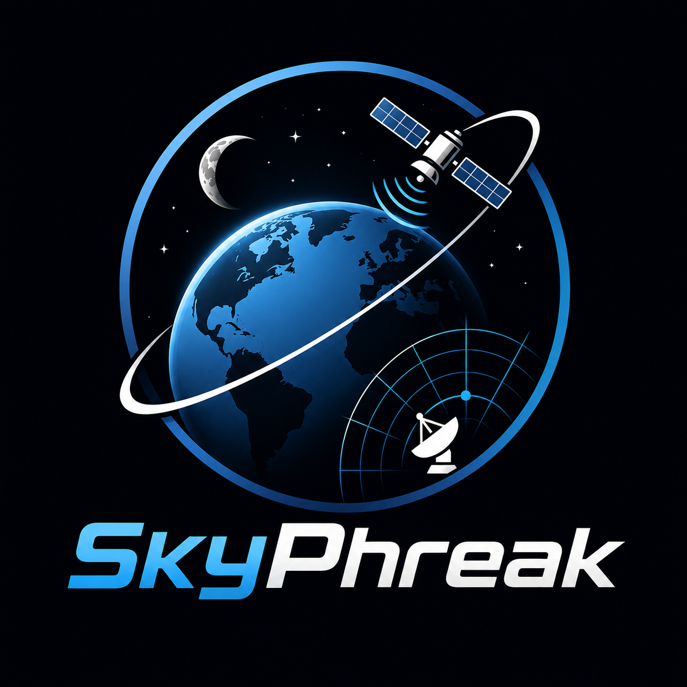

<p align="center">
  
</p>

# SkyPhreak

A clean, high-resolution sky tracker — satellites, the Moon, planets and deep-sky
objects — with the live tracking of gpredict/SkyRoof but sharper visuals and far
less clutter. Live **2D world map** *and* an interactive **3D globe** (toggle
between them), real-time SGP4 propagation, pass prediction, a pass scheduler, and
smooth rotator/radio control with Doppler correction.

(Formerly "PyroSatTrack" / "PyroTrack".)

## Features

- **Live tracking** — TLE fetch from [Celestrak](https://celestrak.org), SGP4
  propagation via `satellite.js`, positions updated every second.
- **2D map** — equirectangular world map drawn from **vector** coastlines, so it
  stays crisp at any zoom. Ground tracks, footprint circles, day/night
  terminator, ground-station marker. Scroll to zoom, drag to pan, click a
  satellite to select.
- **3D globe** — rotatable globe (three.js / globe.gl) with satellites at true
  altitude, the selected orbit path, atmosphere glow, and matching styling.
- **Polar / radar view** — classic az/el sky view with the selected pass arc,
  shown in the Info panel.
- **Moon tracker** — live lunar position (az/el, range, illumination, phase) in
  the Info panel and as a sub-lunar marker on the 2D map. In the 3D globe the
  Moon is rendered at **true scale and distance** (~0.27 R, ~60 R away), so
  zooming out shows the real Earth–Moon system with the satellites near Earth.
- **Sun, planets & deep-sky objects** — the Sky box lists the Sun, all eight
  planets and a curated nebula/DSO catalog. Any of them can be selected as the
  active target: live az/el in the Info panel and on the polar/radar view, a
  sub-point on the map, and **rotator auto-track** (point your dish/antenna at
  Mars, Jupiter, the Orion Nebula, etc.). Planet ephemeris and DSO precession
  are computed locally, so it all works offline. The Moon and any selected sky
  body can drive the rotator exactly like a satellite.
- **Pass prediction** — next 48 h of passes for your ground station (AOS/LOS,
  max elevation, azimuths, duration), refined to ~1 s.
- **Multi-satellite** — track many objects at once; pick groups (Active, ISS,
  Amateur, Weather, NOAA, GOES, Starlink, GPS, Visual) or search the catalog.
- **Rotator + radio control** — connects to Hamlib's `rotctld` and `rigctld`
  over TCP. Auto-track points your antenna at the selected satellite above a
  configurable elevation; Doppler correction tunes the radio to the observed
  downlink frequency in real time.

## Running

```bash
npm install        # installs deps (downloads Electron binary)
npm run dev        # Vite dev server + Electron with hot reload
# or
npm start          # production build, then launch Electron
```

> If `npm install` cannot download the Electron binary (corporate proxy etc.),
> the zip is cached under `%LOCALAPPDATA%\electron\Cache`; re-run
> `node node_modules/electron/install.js`.

### Packaging a Windows installer

```bash
npm run dist       # builds an NSIS installer into release/
```

## Hardware control (optional)

SkyPhreak speaks the Hamlib network protocol — it does not talk to hardware
directly, so start the Hamlib daemons first:

```bash
rotctld -m <rotator-model> -r <port> -t 4533     # antenna rotator
rigctld -m <rig-model>     -r <port> -t 4532     # radio
```

Then in the **Hardware** tab set the host/port (defaults `127.0.0.1:4533` and
`:4532`), connect, and enable *Auto-track* and/or *Doppler correction*. Set the
satellite's downlink frequency there too.

## Configuration

Your ground station, tracked satellites, selected group, and hardware settings
persist automatically (Electron `userData`). Set your location in the
**Station** tab — pass predictions and look angles are computed for it.

## Architecture

```
electron/
  main.cjs      Electron main: window, settings I/O, TLE fetch, Hamlib bridge
  preload.cjs   contextBridge API (no nodeIntegration in the renderer)
  hamlib.cjs    rotctld/rigctld TCP client
src/
  core/         propagate.js (SGP4), tle.js (parse), passes.js, geo.js, store.js
  views/        map2d.js, globe3d.js, polar.js, ui.js
  main.js       orchestration: tick loop, frame building, HW driving
```

Built with Vite + Electron. SGP4 by `satellite.js`, coastlines from
`world-atlas` (Natural Earth), globe by `globe.gl`.
